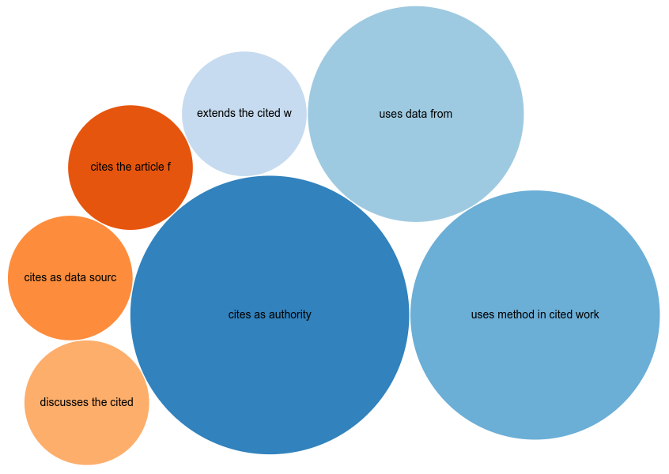

# Introduction

During the *BioHackathon Europe 2021*, the first work started on Citation Typing Ontology (CITO,
[http://purl.org/spar/cito/2018-02-16](http://purl.org/spar/cito/2018-02-16), [@citesAsAuthority:usesMethodIn:CiTO])
support in BioHackrXiv articles [@citesAsAuthority:Willighagen2023CiTO].
We continued this development with a new template developed during the *BioHackathon Europe 2022*
([https://github.com/biohackrxiv/publication-template](https://github.com/biohackrxiv/publication-template)). We took benefit from the CiTO support for Markdown developed by Krewinkel *et al.*
[@usesMethodIn:Krewinkel2017Formatting] and used by the *Journal of Cheminformatics* [@citesAsAuthority:Willighagen2020Adoption]. This Springer Nature journal
was the second journal with an article with explicit CiTO annotation,
and the first to pilot it for a wider audience [@citesAsDataSource:Willighagen2023Two].

Explicit annotations in journal articles are not the only source of citation intention
annotation and several other sources have been annotating citations with their
intentions too. That include CiTO support in CiteULike [@citesAsEvidence:Willighagen2020Adoption]
and in a dataset [@citesAsEvidence:Heibi2021Inputs].
Together, this resulte in over 1,200 citation annotations from over 400 articles.
Of these, 33 have explicit annotations (see Figure 1, [https://scholia.toolforge.org/cito/](https://scholia.toolforge.org/cito/)).

# Citation Typing Ontology annotations

In this paper we focus on articles in the *BioHackathon Europe 2022* proceedings
where authors have used CiTO annotations.
At the time of writing, seven articles had CiTO annotations the were associated
with this 2022 edition of BioHackathon Europe series (see Table 1,
[https://scholia.toolforge.org/venue/Q123154374](https://scholia.toolforge.org/venue/Q123154374)).

Table: Overview of *BioHackathon Europe 2022* reports with CiTO annotations.
Percentages indicate the number of citations with an intention other than `cito:cites`.

|**Article** |**Intentions** | **%CiTO** |
------------ |------------ |---
An ETL pipeline to construct the Intrinsically Disordered Proteins Knowledge Graph (IDP-KG) using Bioschemas JSON-LD data dumps [@citesForInformation:Ammar2022ETL]|cito:extends, cito:usesDataFrom, cito:usesMethodIn|71%|
BioHackEU22 Project 22: Plant data exchange and standard interoperability [@citesForInformation:Arend2022BioHackEU22]|cito:citesAsAuthority|100%|
BioHackEU22 Report for Project 16: Make your own or favourite software available on your cluster with EasyBuild/EESSI [@citesForInformation:Moretti2023BioHackEU22]|cito:citesAsAuthority|100%|
Empowering the community with notebooks for bespoke microbiome analyses [@citesForInformation:Rogers2023Empowering]|cito:citesAsAuthority, cito:usesDataFrom, cito:usesMethodIn, cito:citesAsPotentialSolution|100%|
An evaluation of EDAM coverage in the Tools Ecosystem and prototype integration of Galaxy and WorkflowHub systems [@citesForInformation:Lamothe2023evaluation]|cito:usesDataFrom, cito:usesMethodIn, cito:describe|100%|
Streamlining data brokering from Research Data Management platforms to ELIXIR Repositories [@citesForInformation:D2023Streamlining]|cito:citesAsAuthority, cito:usesDataFrom, cito:usesMethodIn|100%|
BioHackEU22 Report: Enhancing Research Data Management in Galaxy and Data Stewardship Wizard by utilising RO-Crates [@citesForInformation:Eguinoa2023BioHackEU22]|cito:citesAsDataSource, cito:discusses, cito:usesMethodIn|100%|

These seven articles used seven different intention types (see Figure 2). Of these,
`cito:citesAsAuthority`, `cito:usesMethodIn`, and `cito:usesDataFrom` have been
used the most. Two articles only use `cito:citesAsAuthority`. When authors decided
to annotate citaitons, the willingness to do so is extensive:
most articles have all citations typed with their intentions.
Only one article had two citations annotated with the already implied `cito:cites`.

# Discussion

BioHackrXiv has now published published eleven articles annotated with CiTO annotations.
Seven have been published as part of the *BioHackathon Europe 2022* proceedings, as
discussed here. Four others papers had intention annotated too, including the paper
that introduced CiTO annotation to BioHackrXiv [@citesAsEvidence:Willighagen2023CiTO],
two papers from the *DBCLS BioHackathon 2023* in Japan [@citesAsEvidence:Pico2023BioHackJP;@citesAsEvidence:Aoki2023BioHackJP],
and a paper from the *BioHackathon Germany 2022* [@citesAsEvidence:Arend2023Improving].

For hackathons particularly, the reuse of methods, data, and source code is important.
Annotated citations can make such reuse networks visible. Figure 3 shows the network
of typed citations by BioHackrXiv papers, for any BioHackathon. We immediately
see several papers citing the same article. Those articles are likely more relevant
than others. We therefore hope that participants of BioHackathons will continue to used
CiTO annotations.

## Acknowledgements

We thank all the authors of BioHackrXiv papers with CiTO for the annotation of their citations,
and authors of the *BioHackathon Europe 2022* papers in particular.

## References
